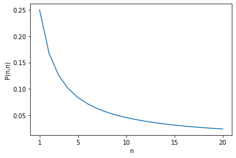
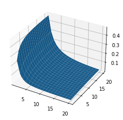

# 概率趣题——吃豆子

:::tip
这篇文章是我在知乎上看到的概率题目后，自己分析、解答的过程。从简单程序模拟入手，到递推式和动态规划，最后求出解析解并证明。希望能给你带来启发。
:::

## 题目

袋子中有白色、黑色两种豆子，且数量相等。每次进行如下操作：

- 从袋子中随机抽取一颗豆子；
- 若为黑色，则直接吃掉；
- 若为白色，则放回重新随机抽取一次，然后不论是什么颜色都直接吃掉。

重复上述操作直到袋中没有豆子。求最后一颗被吃掉的豆子是黑色的概率。

## 题目分析

显然黑色豆子更有可能被吃掉，所以袋中的白色豆子所占比例应该趋向于越来越大。所以最终所求概率应该小于$\frac{1}{2}$。

假设初始有$n$个白色豆子和$n$个黑色豆子。当$n=1$时，我们可以计算出概率：
$$
P(\text{最后一颗是黑色}) = P(\text{第一次抽到白色}) * P(\text{第二次抽到白色}) = \frac 1 4
$$

当$n$变大时，所求概率会更小。因为随着操作次数的增多，黑色豆子应该越来越少，直到达到某个比例，使得黑色豆子被抽出吃掉的概率和白色豆子相等，这样二者的比例才会稳定。随着$n \to \infty$，这个比例应该也逐渐趋近于$0$。那么所求概率也应该逐渐趋近于$0$。

让我们写个程序看看推测是否正确。

## 编程模拟

设最后一个被吃掉的豆子是黑色的概率为$P(n)$，其中$n$是初始时白色豆子的数量和黑色豆子的数量。

首先让我们验证$P(1) = \frac 1 4$。


```python
import random
from typing import Tuple

# 用 Tuple[int, int] 描述容器状态（白色豆子数，黑色豆子数）
ContainerState = Tuple[int, int]

# 操作一次（指按题目操作直到吃掉一颗豆子），并返回容器状态
def operate_once(state: ContainerState) -> ContainerState:
    selection = 0 if random.randint(0, state[0] + state[1] - 1) < state[0] else 1
    if selection == 0:
        # 抽到白色豆子，放回并重新抽取
        selection = 0 if random.randint(0, state[0] + state[1] - 1) < state[0] else 1
    if selection == 0:
        return state[0] - 1, state[1]
    else:
        return state[0], state[1] - 1

# 模拟一遍完整的操作过程，并返回最后一个吃掉的豆子的颜色（0 为白色，1 为黑色）
def simulate(n: int) -> int:
    state = n, n
    while state[0] and state[1]:
        state = operate_once(state)
    return 0 if state[0] else 1

# 模拟多次，并计算 P(n)；其中 T 为总模拟次数
def simulate_and_calc_prob(n: int, T: int = 100000) -> float:
    num_cases_last_is_black = 0
    num_cases_total = T
    for _ in range(num_cases_total):
        result = simulate(n)
        if result == 1:
            num_cases_last_is_black += 1
    return float(num_cases_last_is_black) / float(num_cases_total)

print("P(1) =", simulate_and_calc_prob(1))
```

    P(1) = 0.25098


## 更多的豆子

结果和我们预想的一致。让我们尝试一下更大的$n$。


```python
for n in [1, 2, 3, 4, 5, 10, 100]:
    print("P({}) =".format(n), simulate_and_calc_prob(n))
```

    P(1) = 0.25073
    P(2) = 0.16579
    P(3) = 0.12502
    P(4) = 0.09817
    P(5) = 0.08408
    P(10) = 0.04548
    P(100) = 0.005


## 更快的程序？

好吧，结果确实随着$n$的增大而逐渐接近零了，这符合我们的预期。但是这个程序太慢了，我们来尝试加速一下这个程序。

注意到每次抽取豆子时，抽到不同豆子的概率与剩余两种豆子的数量有关。假设现在有$x$个白色豆子和$y$个黑色豆子，下一个吃掉的豆子的颜色为白色和黑色的概率分别是：
$$
\begin{aligned}
P(\text{吃到白色豆子}) &= P(\text{第一次抽出白色}) \cdot P(\text{第二次抽出白色}) \\
&= \frac{x}{x + y} \times \frac{x}{x + y} \\
&= \frac{x^2}{(x + y)^2} \\
P(\text{吃到黑色豆子}) &= P(\text{第一次抽到黑色}) + P(\text{第一次抽到白色}) \cdot P(\text{第二次抽到黑色}) \\
&= \frac{y}{x + y} + \frac{x}{x + y} \times \frac{y}{x + y} \\
&= \frac{2 x y + y^2}{(x + y)^2}
\end{aligned}
$$

让我们基于这些公式重写一下程序。


```python
# 操作一次（指按题目操作直到吃掉一颗豆子），并返回容器状态
def operate_once_faster(state: ContainerState) -> ContainerState:
    prob_white = float(state[0]) * float(state[0]) / (float(state[0] + state[1]) * float(state[0] + state[1]))
    selection = 0 if random.random() < prob_white else 1
    if selection == 0:
        return state[0] - 1, state[1]
    else:
        return state[0], state[1] - 1
    
# 模拟一遍完整的操作过程，并返回最后一个吃掉的豆子的颜色（0 为白色，1 为黑色）
def simulate_faster(n: int) -> int:
    state = n, n
    while state[0] and state[1]:
        state = operate_once_faster(state)
    return 0 if state[0] else 1

# 模拟多次，并计算 P(n)；其中 T 为总模拟次数
def simulate_and_calc_prob_faster(n: int, T: int = 100000) -> float:
    num_cases_last_is_black = 0
    num_cases_total = T
    for _ in range(num_cases_total):
        result = simulate_faster(n)
        if result == 1:
            num_cases_last_is_black += 1
    return float(num_cases_last_is_black) / float(num_cases_total)

for n in [1, 2, 3, 4, 5, 10, 100]:
    print("P({}) =".format(n), simulate_and_calc_prob_faster(n))
```

    P(1) = 0.25076
    P(2) = 0.1669
    P(3) = 0.1241
    P(4) = 0.10211
    P(5) = 0.08278
    P(10) = 0.04681
    P(100) = 0.00507


## 不再模拟

当然刚才这样并不会让程序变快，因为总的模拟次数并没有变少。（虽然我们调用`random()`函数的次数确实变少了。）但观察这些公式，我们可以发现一个不用多次模拟就能求得概率的方法！

设当前状态为$(x, y)$，即有$x$颗白色豆子和$y$颗黑色豆子。我们用$P(x, y)$表示$P(\text{最后一颗是黑色}|\text{状态为}(x,y))$。那么$P(n, n)$就是题目所求概率。注意：我们之所以可以这样做，是因为在状态为$(x, y)$的情况下，最后一颗是黑色的概率与之前的豆子数、吃豆顺序都已经无关了，即我们常说的“无后效性”。

利用递推的方法，我们可以建立$P(x, y)$和$P(x - 1, y)$、$P(x, y - 1)$之间的关系：
$$
\begin{aligned}
P(x, y) &= P(\text{吃到白色豆子}) \cdot P(x - 1, y) + P(\text{吃到黑色豆子}) \cdot P(x, y - 1)\\
&=\frac{x^2}{(x + y)^2} \cdot P(x - 1, y) + \frac{2 x y + y^2}{(x + y)^2} \cdot P(x, y - 1)
\end{aligned}
$$

我们还知道初始条件：
$$
\begin{aligned}
P(0, y) &= 1\\
P(x, 0) &= 0
\end{aligned}
$$

那么我们可以用动态规划的方法求出$P(n, n)$的值。


```python
from typing import List

# 用动态规划计算 P(x, y)
def calc_prob_by_dp(n: int) -> float:
    # p[x] = P(x, y)，其中 y 随着迭代的进行会不断变化。
    p: List[float] = [0.0] * (n + 1)
    # last_p[x] = P(x, y - 1)
    last_p: List[float] = [0.0] * (n + 1)
    
    for y in range(1, n + 1):
        p[0] = 1.0
        for x in range(1, n + 1):
            prob_white = float(x) * float(x) / (float(x + y) * float(x + y))
            p[x] = prob_white * p[x - 1] + (1.0 - prob_white) * last_p[x]
        p, last_p = last_p, p
    
    return last_p[n]

for n in [1, 2, 3, 4, 5, 10, 100]:
    print("P({}) =".format(n), calc_prob_by_dp(n))
```

    P(1) = 0.25
    P(2) = 0.16666666666666666
    P(3) = 0.125
    P(4) = 0.09999999999999999
    P(5) = 0.08333333333333333
    P(10) = 0.04545454545454545
    P(100) = 0.004950495049504951


## 画图

虽然得到了数值解，但是我们感觉到，这个题目应该是有解析解的，解析解可以通过递推式求出。但是我这么菜，显然是看不出来如何求解析解的，所以我们从数值解找找规律。

我们来画一下$P(n, n)$随$n$变化的图像。


```python
# 用动态规划计算 P(x, y)
def calc_prob_by_dp_all(n: int) -> List[float]:
    # p[x] = P(x, y)，其中 y 随着迭代的进行会不断变化。
    p: List[float] = [0.0] * (n + 1)
    # last_p[x] = P(x, y - 1)
    last_p: List[float] = [0.0] * (n + 1)
    # p_all[n - 1] = P(n, n)
    p_all: List[float] = [0.0] * n
    
    for y in range(1, n + 1):
        p[0] = 1.0
        for x in range(1, n + 1):
            prob_white = float(x) * float(x) / (float(x + y) * float(x + y))
            p[x] = prob_white * p[x - 1] + (1.0 - prob_white) * last_p[x]
        p_all[y - 1] = p[y]
        p, last_p = last_p, p
    
    return p_all

from matplotlib import pyplot as plt

N = 20
ps = calc_prob_by_dp_all(N)
ns = list(range(1, N + 1))
plt.plot(ns, ps)
plt.xlabel('n')
plt.xticks([1, 5, 10, 15, 20])
plt.ylabel('P(n,n)')
plt.show()
```


    

    


## 结果分析

图像看起来是符合预期的。而且所求概率随着$n$的增大大约是反比例衰减的。

我们注意到：
$$
\begin{aligned}
P(1) &= \frac 1 4 &\qquad
P(2) &\approx \frac 1 6\\
P(3) &\approx \frac 1 8 &\qquad
P(4) &\approx \frac 1 {10}\\
P(5) &\approx \frac 1 {12} &\qquad
P(10) &\approx \frac 1 {22}\\
P(100) &\approx \frac 1 {202} &\qquad&
\end{aligned}
$$

嗯……看起来:
$$
P(n, n) = \frac{1}{2n+2}
$$

可是只猜到了$P(n, n)$的表达式，是无法完成证明的。要想通过递推式证明这个表达式，需要先得到任意的$P(x, y)$的表达式。我们最好还是画一下图、列一下数据看看。


```python
# 用动态规划计算 P(x, y)
def calc_prob_by_dp_all_xy(n: int) -> List[List[float]]:
    # p[y][x] = P(x, y)
    p: List[List[float]] = [[0.0] * (n + 1) for _ in range(n + 1)]
    
    for y in range(1, n + 1):
        p[y][0] = 1.0
        for x in range(1, n + 1):
            prob_white = float(x) * float(x) / (float(x + y) * float(x + y))
            p[y][x] = prob_white * p[y][x - 1] + (1.0 - prob_white) * p[y - 1][x]
    
    return p

import numpy as np

N = 20
p = calc_prob_by_dp_all_xy(N)
x, y = np.meshgrid(np.arange(1, N + 1), np.arange(1, N + 1))
axes = plt.axes(projection='3d')
axes.plot_surface(x, y, np.array([p[y + 1][1:] for y in range(N)]))
plt.show()
plt.figure()
ps = [p[n][n] for n in ns]
plt.plot(ns, ps)
plt.xlabel('n')
plt.xticks([1, 5, 10, 15, 20])
plt.ylabel('P(n,n)')
plt.show()
```


    

    


    

    


```python
import pandas as pd
pd.DataFrame(np.array(p)[:-1,:-1])
```


<div>
<style scoped>
    .dataframe tbody tr th:only-of-type {
        vertical-align: middle;
    }

    .dataframe tbody tr th {
        vertical-align: top;
    }

    .dataframe thead th {
        text-align: right;
    }
</style>
<table border="1" class="dataframe">
  <thead>
    <tr style="text-align: right;">
      <th></th>
      <th>0</th>
      <th>1</th>
      <th>2</th>
      <th>3</th>
      <th>4</th>
      <th>5</th>
      <th>6</th>
      <th>7</th>
      <th>8</th>
      <th>9</th>
      <th>10</th>
      <th>11</th>
      <th>12</th>
      <th>13</th>
      <th>14</th>
      <th>15</th>
      <th>16</th>
      <th>17</th>
      <th>18</th>
      <th>19</th>
    </tr>
  </thead>
  <tbody>
    <tr>
      <th>0</th>
      <td>0.0</td>
      <td>0.000000</td>
      <td>0.000000</td>
      <td>0.000000</td>
      <td>0.000000</td>
      <td>0.000000</td>
      <td>0.000000</td>
      <td>0.000000</td>
      <td>0.000000</td>
      <td>0.000000</td>
      <td>0.000000</td>
      <td>0.000000</td>
      <td>0.000000</td>
      <td>0.000000</td>
      <td>0.000000</td>
      <td>0.000000</td>
      <td>0.000000</td>
      <td>0.000000</td>
      <td>0.000000</td>
      <td>0.000000</td>
    </tr>
    <tr>
      <th>1</th>
      <td>1.0</td>
      <td>0.250000</td>
      <td>0.111111</td>
      <td>0.062500</td>
      <td>0.040000</td>
      <td>0.027778</td>
      <td>0.020408</td>
      <td>0.015625</td>
      <td>0.012346</td>
      <td>0.010000</td>
      <td>0.008264</td>
      <td>0.006944</td>
      <td>0.005917</td>
      <td>0.005102</td>
      <td>0.004444</td>
      <td>0.003906</td>
      <td>0.003460</td>
      <td>0.003086</td>
      <td>0.002770</td>
      <td>0.002500</td>
    </tr>
    <tr>
      <th>2</th>
      <td>1.0</td>
      <td>0.333333</td>
      <td>0.166667</td>
      <td>0.100000</td>
      <td>0.066667</td>
      <td>0.047619</td>
      <td>0.035714</td>
      <td>0.027778</td>
      <td>0.022222</td>
      <td>0.018182</td>
      <td>0.015152</td>
      <td>0.012821</td>
      <td>0.010989</td>
      <td>0.009524</td>
      <td>0.008333</td>
      <td>0.007353</td>
      <td>0.006536</td>
      <td>0.005848</td>
      <td>0.005263</td>
      <td>0.004762</td>
    </tr>
    <tr>
      <th>3</th>
      <td>1.0</td>
      <td>0.375000</td>
      <td>0.200000</td>
      <td>0.125000</td>
      <td>0.085714</td>
      <td>0.062500</td>
      <td>0.047619</td>
      <td>0.037500</td>
      <td>0.030303</td>
      <td>0.025000</td>
      <td>0.020979</td>
      <td>0.017857</td>
      <td>0.015385</td>
      <td>0.013393</td>
      <td>0.011765</td>
      <td>0.010417</td>
      <td>0.009288</td>
      <td>0.008333</td>
      <td>0.007519</td>
      <td>0.006818</td>
    </tr>
    <tr>
      <th>4</th>
      <td>1.0</td>
      <td>0.400000</td>
      <td>0.222222</td>
      <td>0.142857</td>
      <td>0.100000</td>
      <td>0.074074</td>
      <td>0.057143</td>
      <td>0.045455</td>
      <td>0.037037</td>
      <td>0.030769</td>
      <td>0.025974</td>
      <td>0.022222</td>
      <td>0.019231</td>
      <td>0.016807</td>
      <td>0.014815</td>
      <td>0.013158</td>
      <td>0.011765</td>
      <td>0.010582</td>
      <td>0.009569</td>
      <td>0.008696</td>
    </tr>
    <tr>
      <th>5</th>
      <td>1.0</td>
      <td>0.416667</td>
      <td>0.238095</td>
      <td>0.156250</td>
      <td>0.111111</td>
      <td>0.083333</td>
      <td>0.064935</td>
      <td>0.052083</td>
      <td>0.042735</td>
      <td>0.035714</td>
      <td>0.030303</td>
      <td>0.026042</td>
      <td>0.022624</td>
      <td>0.019841</td>
      <td>0.017544</td>
      <td>0.015625</td>
      <td>0.014006</td>
      <td>0.012626</td>
      <td>0.011442</td>
      <td>0.010417</td>
    </tr>
    <tr>
      <th>6</th>
      <td>1.0</td>
      <td>0.428571</td>
      <td>0.250000</td>
      <td>0.166667</td>
      <td>0.120000</td>
      <td>0.090909</td>
      <td>0.071429</td>
      <td>0.057692</td>
      <td>0.047619</td>
      <td>0.040000</td>
      <td>0.034091</td>
      <td>0.029412</td>
      <td>0.025641</td>
      <td>0.022556</td>
      <td>0.020000</td>
      <td>0.017857</td>
      <td>0.016043</td>
      <td>0.014493</td>
      <td>0.013158</td>
      <td>0.012000</td>
    </tr>
    <tr>
      <th>7</th>
      <td>1.0</td>
      <td>0.437500</td>
      <td>0.259259</td>
      <td>0.175000</td>
      <td>0.127273</td>
      <td>0.097222</td>
      <td>0.076923</td>
      <td>0.062500</td>
      <td>0.051852</td>
      <td>0.043750</td>
      <td>0.037433</td>
      <td>0.032407</td>
      <td>0.028340</td>
      <td>0.025000</td>
      <td>0.022222</td>
      <td>0.019886</td>
      <td>0.017903</td>
      <td>0.016204</td>
      <td>0.014737</td>
      <td>0.013462</td>
    </tr>
    <tr>
      <th>8</th>
      <td>1.0</td>
      <td>0.444444</td>
      <td>0.266667</td>
      <td>0.181818</td>
      <td>0.133333</td>
      <td>0.102564</td>
      <td>0.081633</td>
      <td>0.066667</td>
      <td>0.055556</td>
      <td>0.047059</td>
      <td>0.040404</td>
      <td>0.035088</td>
      <td>0.030769</td>
      <td>0.027211</td>
      <td>0.024242</td>
      <td>0.021739</td>
      <td>0.019608</td>
      <td>0.017778</td>
      <td>0.016194</td>
      <td>0.014815</td>
    </tr>
    <tr>
      <th>9</th>
      <td>1.0</td>
      <td>0.450000</td>
      <td>0.272727</td>
      <td>0.187500</td>
      <td>0.138462</td>
      <td>0.107143</td>
      <td>0.085714</td>
      <td>0.070312</td>
      <td>0.058824</td>
      <td>0.050000</td>
      <td>0.043062</td>
      <td>0.037500</td>
      <td>0.032967</td>
      <td>0.029221</td>
      <td>0.026087</td>
      <td>0.023438</td>
      <td>0.021176</td>
      <td>0.019231</td>
      <td>0.017544</td>
      <td>0.016071</td>
    </tr>
    <tr>
      <th>10</th>
      <td>1.0</td>
      <td>0.454545</td>
      <td>0.277778</td>
      <td>0.192308</td>
      <td>0.142857</td>
      <td>0.111111</td>
      <td>0.089286</td>
      <td>0.073529</td>
      <td>0.061728</td>
      <td>0.052632</td>
      <td>0.045455</td>
      <td>0.039683</td>
      <td>0.034965</td>
      <td>0.031056</td>
      <td>0.027778</td>
      <td>0.025000</td>
      <td>0.022624</td>
      <td>0.020576</td>
      <td>0.018797</td>
      <td>0.017241</td>
    </tr>
    <tr>
      <th>11</th>
      <td>1.0</td>
      <td>0.458333</td>
      <td>0.282051</td>
      <td>0.196429</td>
      <td>0.146667</td>
      <td>0.114583</td>
      <td>0.092437</td>
      <td>0.076389</td>
      <td>0.064327</td>
      <td>0.055000</td>
      <td>0.047619</td>
      <td>0.041667</td>
      <td>0.036789</td>
      <td>0.032738</td>
      <td>0.029333</td>
      <td>0.026442</td>
      <td>0.023965</td>
      <td>0.021825</td>
      <td>0.019964</td>
      <td>0.018333</td>
    </tr>
    <tr>
      <th>12</th>
      <td>1.0</td>
      <td>0.461538</td>
      <td>0.285714</td>
      <td>0.200000</td>
      <td>0.150000</td>
      <td>0.117647</td>
      <td>0.095238</td>
      <td>0.078947</td>
      <td>0.066667</td>
      <td>0.057143</td>
      <td>0.049587</td>
      <td>0.043478</td>
      <td>0.038462</td>
      <td>0.034286</td>
      <td>0.030769</td>
      <td>0.027778</td>
      <td>0.025210</td>
      <td>0.022989</td>
      <td>0.021053</td>
      <td>0.019355</td>
    </tr>
    <tr>
      <th>13</th>
      <td>1.0</td>
      <td>0.464286</td>
      <td>0.288889</td>
      <td>0.203125</td>
      <td>0.152941</td>
      <td>0.120370</td>
      <td>0.097744</td>
      <td>0.081250</td>
      <td>0.068783</td>
      <td>0.059091</td>
      <td>0.051383</td>
      <td>0.045139</td>
      <td>0.040000</td>
      <td>0.035714</td>
      <td>0.032099</td>
      <td>0.029018</td>
      <td>0.026369</td>
      <td>0.024074</td>
      <td>0.022071</td>
      <td>0.020313</td>
    </tr>
    <tr>
      <th>14</th>
      <td>1.0</td>
      <td>0.466667</td>
      <td>0.291667</td>
      <td>0.205882</td>
      <td>0.155556</td>
      <td>0.122807</td>
      <td>0.100000</td>
      <td>0.083333</td>
      <td>0.070707</td>
      <td>0.060870</td>
      <td>0.053030</td>
      <td>0.046667</td>
      <td>0.041420</td>
      <td>0.037037</td>
      <td>0.033333</td>
      <td>0.030172</td>
      <td>0.027451</td>
      <td>0.025090</td>
      <td>0.023026</td>
      <td>0.021212</td>
    </tr>
    <tr>
      <th>15</th>
      <td>1.0</td>
      <td>0.468750</td>
      <td>0.294118</td>
      <td>0.208333</td>
      <td>0.157895</td>
      <td>0.125000</td>
      <td>0.102041</td>
      <td>0.085227</td>
      <td>0.072464</td>
      <td>0.062500</td>
      <td>0.054545</td>
      <td>0.048077</td>
      <td>0.042735</td>
      <td>0.038265</td>
      <td>0.034483</td>
      <td>0.031250</td>
      <td>0.028463</td>
      <td>0.026042</td>
      <td>0.023923</td>
      <td>0.022059</td>
    </tr>
    <tr>
      <th>16</th>
      <td>1.0</td>
      <td>0.470588</td>
      <td>0.296296</td>
      <td>0.210526</td>
      <td>0.160000</td>
      <td>0.126984</td>
      <td>0.103896</td>
      <td>0.086957</td>
      <td>0.074074</td>
      <td>0.064000</td>
      <td>0.055944</td>
      <td>0.049383</td>
      <td>0.043956</td>
      <td>0.039409</td>
      <td>0.035556</td>
      <td>0.032258</td>
      <td>0.029412</td>
      <td>0.026936</td>
      <td>0.024768</td>
      <td>0.022857</td>
    </tr>
    <tr>
      <th>17</th>
      <td>1.0</td>
      <td>0.472222</td>
      <td>0.298246</td>
      <td>0.212500</td>
      <td>0.161905</td>
      <td>0.128788</td>
      <td>0.105590</td>
      <td>0.088542</td>
      <td>0.075556</td>
      <td>0.065385</td>
      <td>0.057239</td>
      <td>0.050595</td>
      <td>0.045093</td>
      <td>0.040476</td>
      <td>0.036559</td>
      <td>0.033203</td>
      <td>0.030303</td>
      <td>0.027778</td>
      <td>0.025564</td>
      <td>0.023611</td>
    </tr>
    <tr>
      <th>18</th>
      <td>1.0</td>
      <td>0.473684</td>
      <td>0.300000</td>
      <td>0.214286</td>
      <td>0.163636</td>
      <td>0.130435</td>
      <td>0.107143</td>
      <td>0.090000</td>
      <td>0.076923</td>
      <td>0.066667</td>
      <td>0.058442</td>
      <td>0.051724</td>
      <td>0.046154</td>
      <td>0.041475</td>
      <td>0.037500</td>
      <td>0.034091</td>
      <td>0.031142</td>
      <td>0.028571</td>
      <td>0.026316</td>
      <td>0.024324</td>
    </tr>
    <tr>
      <th>19</th>
      <td>1.0</td>
      <td>0.475000</td>
      <td>0.301587</td>
      <td>0.215909</td>
      <td>0.165217</td>
      <td>0.131944</td>
      <td>0.108571</td>
      <td>0.091346</td>
      <td>0.078189</td>
      <td>0.067857</td>
      <td>0.059561</td>
      <td>0.052778</td>
      <td>0.047146</td>
      <td>0.042411</td>
      <td>0.038384</td>
      <td>0.034926</td>
      <td>0.031933</td>
      <td>0.029321</td>
      <td>0.027027</td>
      <td>0.025000</td>
    </tr>
  </tbody>
</table>
</div>


## 结果再分析

嗯……看起来：
$$
\begin{aligned}
P(x,1)&=\frac{1}{(x+1)^2}\\
P(x,2)&=\frac{2}{(x+1)(x+2)}\\
P(x,3)&=\frac{3}{(x+1)(x+3)}\\
...&
\end{aligned}
$$
也许我们有：
$$
P(x,y)=\frac{y}{(x+1)(x+y)}
$$

这个猜得对不对呢？我们验证一下。首先它确实满足我们之前的猜测$P(n,n)=\frac{1}{2n+2}$。

接下来我们验证它完全正确。首先关于边界条件，有：
$$
\begin{aligned}
P(x, 0) &= \frac{0}{x(x+1)} = 0\\
P(0, y) &= \frac{y}{y} = 1
\end{aligned}
$$

结果不错。然后是递推式：
$$
\begin{aligned}
P(x, y) &= \frac{x^2}{(x + y)^2} \cdot P(x - 1, y) + \frac{2 x y + y^2}{(x + y)^2} \cdot P(x, y - 1) \\
&= \frac{x^2}{(x + y)^2} \cdot \frac{y}{x(x+y-1)} + \frac{2 x y + y^2}{(x + y)^2} \cdot \frac{y-1}{(x+1)(x+y-1)} \\
&= \frac{xy(x+1)}{(x + y)^2(x+1)(x+y-1)} + \frac{(2 x y + y^2)(y-1)}{(x + y)^2(x+1)(x+y-1)} \\
&= \frac{x^2y+xy+2xy^2+y^3-2xy-y^2}{(x + y)^2(x+1)(x+y-1)} \\
&= \frac{y(x^2+x+2xy+y^2-2x-y)}{(x + y)^2(x+1)(x+y-1)} \\
&= \frac{y((x+y)^2-(x+y))}{(x + y)^2(x+1)(x+y-1)} \\
&= \frac{y((x+y)(x+y-1))}{(x + y)^2(x+1)(x+y-1)} \\
&= \frac{y}{(x+1)(x+y)}
\end{aligned}
$$

## OHHHHHHH

太棒了，所以初始有$x$颗白色豆子和$y$颗黑色豆子时，最后一颗是黑色的概率是：
$$
P(x,y)=\frac{y}{(x+1)(x+y)}
$$
对于题目所说的初始时黑色豆子和白色豆子相同（均为$n$）的条件下，最后一颗是黑色的概率是：
$$
P(n, n) = \frac{1}{2n+2}
$$

:::slot content-bottom
<div class="page-meta">
    <div class="edit-link">
        <a href="https://github.com/wenjinghuan999/wenjinghuan-cn/blob/main/notebook/eat_beans.ipynb" target="_blank" rel="noopener noreferrer">查看原始Notebook</a>
    </div>
</div>
:::
