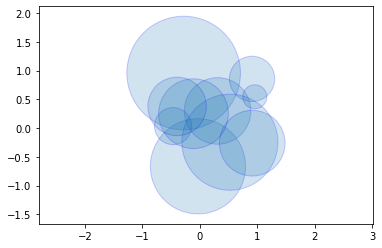
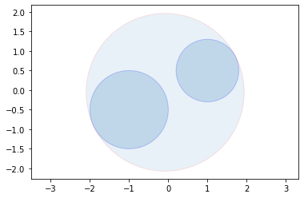
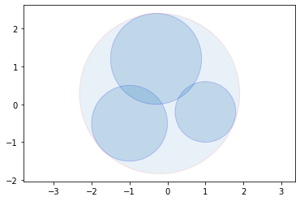
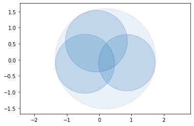
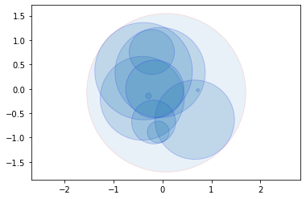

# 最小圆包含问题

## 问题

最近需要处理一个问题，即给定平面上的一些圆（下文称内部圆），寻找一个能够包含它们的最小圆（下文称所求圆）。

稍作调研后，发现了一个算法：[Welzl 算法](https://en.wikipedia.org/wiki/Smallest-circle_problem)。这个算法是用来找包含给定点集的最小圆的，但是想象中应该也能用于本问题。

唯一需要考虑的是递归的终止条件。原算法在 $|R| = 3$ 时终止，因为三个边界上的点可以确定一个圆。在本问题中，$R$ 应该代表的是与所求圆相切的内部圆，并且一般而言，三个内部圆可唯一确定一个唯一的外接圆。所以本问题的递归终止条件也是 $|R| = 3$，并且此时所求圆可通过求解一个三元二次方程组得出。

类似于原 Welzl 算法，本问题的算法如下。

> $\text{welzl}$ 算法为：
>
> - **输入**: 平面上的圆的集合 $P$ 和 $R$。
> - **输出**: 包含 $P$ 和 $R$，且与 $R$ 中的圆相切的最小圆。
>
> - 如果 $P$ 为空或 $|R| = 3$：
>   - 返回 $\text{trivial}(R)$
> - 在 $P$ 中等概率地随机选取一个圆 $p$
> - $D := \text{welzl}(P − \{p\}, R)$
> - 如果 $p$ 在 $D$ 内部
>   - 返回 $D$
> - 否则
>   - 返回 $\text{welzl}(P − \{p\}, R \cup \{p\})$

下面开始具体实现。

## 随机生成平面上的圆

实现代码如下。


```python
import random
from typing import Tuple, List
from matplotlib import pyplot as plt
import matplotlib.patches
import matplotlib.collections

Point = Tuple[float, float]

class Circle:
    def __init__(self, center: Point = (0.0, 0.0), radius: float = 0.0) -> None:
        self.center = center
        self.radius = radius
    
    def __str__(self):
        return f'({self.center[0]}, {self.center[1]}, {self.radius})'

# https://stackoverflow.com/questions/9081553/python-scatter-plot-size-and-style-of-the-marker/24567352#24567352
# https://stackoverflow.com/a/24568380/4635234
def draw_circles(circles: List[Circle], **kwargs):
    circle_args = dict()
    if 'fill' in kwargs: circle_args['fill'] = kwargs.pop('fill')
    if 'color' in kwargs: circle_args['color'] = kwargs.pop('color')
    patches = [matplotlib.patches.Circle(circle.center, circle.radius, **circle_args) for circle in circles]
    collection = matplotlib.collections.PatchCollection(patches, **kwargs)

    ax = plt.gca()
    ax.add_collection(collection)
    ax.autoscale_view()
    ax.axis('equal')

def generate_circles(n: int, pos_range: Tuple[float, float], radius_range: Tuple[float, float]) -> List[Circle]:
    return [Circle((random.random() * (pos_range[1] - pos_range[0]) + pos_range[0], 
            random.random() * (pos_range[1] - pos_range[0]) + pos_range[0]), 
            random.random() * (radius_range[1] - radius_range[0]) + radius_range[0]) 
            for _ in range(n)]

draw_circles(generate_circles(10, (-1, 1), (0, 1)), alpha=0.2, color='r', edgecolor='b')

```


    

    


## 对于平凡情况的处理

平凡情况是指给定一至三个圆，求与它们均相切的外接圆。

求与一个圆相切的外接圆，外接圆是它本身。

求与两个圆相切的外接圆，外接圆的圆心位于两个圆的圆心连线上，直径等于两圆心距离加上各自半径。
$$
\begin{aligned}
& D = r_1 + r_2 + |\overrightarrow{O_1O_2}| \\
& \lambda = \frac{\frac{D}{2} - r1}{|\overrightarrow{O_1O_2}|} = \frac{1}{2}\left(1+\frac{r_2-r_1}{|\overrightarrow{O_1O_2}|}\right) \\
& \overrightarrow{O_1O} = \lambda \cdot \overrightarrow{O_1O_2}
\end{aligned}
$$

求与三个圆相切的外接圆，设其圆心位于 $(x, y)$，半径为 $r$，则应有
$$
\begin{aligned}
(x - x_1)^2 + (y - y_1)^2 &= (r - r_1)^2 \\
(x - x_2)^2 + (y - y_2)^2 &= (r - r_2)^2 \\
(x - x_3)^2 + (y - y_3)^2 &= (r - r_3)^2
\end{aligned}
$$
其中 $(x_i, y_i)$、$r_i$ 分别为三个给定圆的圆心和半径。

用第二、三个等式减掉第一个等式，得
$$
\begin{aligned}
& -2(x_2 - x_1)x + (x_2^2 - x_1^2) - 2(y_2 - y_1)y + (y_2^2 - y_1^2) = -2(r_2 - r_1)r + (r_2^2 - r_1^2) \\
& -2(x_3 - x_1)x + (x_3^2 - x_1^2) - 2(y_3 - y_1)y + (y_3^2 - y_1^2) = -2(r_3 - r_1)r + (r_3^2 - r_1^2)
\end{aligned}
$$
即
$$
\begin{aligned}
& (x_1 - x_2)x + (y_1 - y_2)y = (r_1 - r_2)r + \frac{1}{2}\left((r_2^2 - r_1^2) - (x_2^2 - x_1^2) - (y_2^2 - y_1^2)\right)  \\
& (x_1 - x_3)x + (y_1 - y_3)y = (r_1 - r_3)r + \frac{1}{2}\left((r_3^2 - r_1^2) - (x_3^2 - x_1^2) - (y_3^2 - y_1^2)\right)
\end{aligned}
$$
或者记为
$$
\begin{aligned}
& A_1x + B_1y = C_1r + D_1 \\
& A_2x + B_2y = C_2r + D_2
\end{aligned}
$$

这是一个关于 $x$、$y$ 的二元一次方程组，可以解得
$$
\begin{aligned}
x &= \frac{(B_1C_2 - B_2C_1)r + (B_1D_2 - B_2D_1)}{A_2B_1 - A_1B_2} = M_1r + N_1 \\
y &= \frac{(A_1C_2 - A_2C_1)r + (A_1D_2 - A_2D_1)}{A_1B_2 - A_2B_1} = M_2r + N_2 \\
\end{aligned}
$$

所以代入原方程组，有
$$
(M_1^2 + M_2^2 - 1)r^2 + 2(M_1N_1 + M_2N_2 - M_1x_1 - M_2y_1 + r1)r + N_1^2 -2N_1x_1 + x_1^2 + N_2^2 -2N_2y_1 + y_1^2 - r_1^2 = 0
$$

求解该关于 $r$ 的一元二次方程即可得到 $r$，从而求出 $x$、$y$。

相应的代码如下。


```python
import math

def dist(a: Point, b: Point) -> float:
    return math.sqrt((a[0] - b[0]) * (a[0] - b[0]) + (a[1] - b[1]) * (a[1] - b[1]))

def interp(a: Point, b: Point, l: float) -> Point:
    return (l * b[0] + (1 - l) * a[0], l * b[1] + (1 - l) * a[1])

def inside(a: Circle, b: Circle) -> bool:
    return dist(a.center, b.center) + a.radius <= b.radius + 1e-5

def trivial3(R: List[Circle]) -> Circle:
    x1, y1, r1 = R[0].center[0], R[0].center[1], R[0].radius
    x2, y2, r2 = R[1].center[0], R[1].center[1], R[1].radius
    x3, y3, r3 = R[2].center[0], R[2].center[1], R[2].radius

    A1 = x1 - x2
    B1 = y1 - y2
    C1 = r1 - r2
    D1 = (r2*r2 - r1*r1 + x1*x1 - x2*x2 + y1*y1 - y2*y2) / 2.0
    A2 = x1 - x3
    B2 = y1 - y3
    C2 = r1 - r3
    D2 = (r3*r3 - r1*r1 + x1*x1 - x3*x3 + y1*y1 - y3*y3) / 2.0
    M1 = (B1*C2 - B2*C1) / (A2*B1 - A1*B2)
    N1 = (B1*D2 - B2*D1) / (A2*B1 - A1*B2)
    M2 = (A1*C2 - A2*C1) / (A1*B2 - A2*B1)
    N2 = (A1*D2 - A2*D1) / (A1*B2 - A2*B1)
    A = M1*M1 + M2*M2 - 1
    B = 2*(M1*N1 + M2*N2 - M1*x1 - M2*y1 + r1)
    C = N1*N1 - 2*N1*x1 + x1*x1 + N2*N2 - 2*N2*y1 + y1*y1 - r1*r1
    delta = B*B - 4*A*C
    delta = delta if delta > 0 else 0.0
    
    ra = (-B + math.sqrt(delta)) / (2.0 * A)
    xa = M1*ra + N1
    ya = M2*ra + N2
    ca = Circle((xa, ya), ra)
    rb = (-B - math.sqrt(delta)) / (2.0 * A)
    xb = M1*rb + N1
    yb = M2*rb + N2
    cb = Circle((xb, yb), rb)

    ok_a = inside(R[0], ca) and inside(R[1], ca) and inside(R[2], ca)
    ok_b = inside(R[0], cb) and inside(R[1], cb) and inside(R[2], cb)
    if ok_a and ok_b:
        return ca if ca.radius < cb.radius else cb
    elif ok_a:
        return ca
    elif ok_b:
        return cb
    else:
        return Circle()

def trivial(R: List[Circle]):
    if len(R) > 3:
        raise RuntimeError('len(R) <= 3')
    elif len(R) == 0:
        return Circle()
    elif len(R) == 1:
        return R[0]
    elif len(R) == 2:
        distance = dist(R[0].center, R[1].center)
        diameter = R[0].radius + R[1].radius + distance
        l = (1.0 + (R[1].radius - R[0].radius) / distance) / 2.0
        center = interp(R[0].center, R[1].center, l)
        return Circle(center, diameter / 2.0)
    else:
        return trivial3(R)

two_circles = [Circle((-1, -0.5), 1), Circle((1, 0.5), 0.8)]
center_two = trivial(two_circles)
three_circles = [Circle((-1, -0.5), 1), Circle((1, -0.2), 0.8), Circle((-0.3, 1.2), 1.2)]
center_three = trivial(three_circles)
random_three = generate_circles(3, (-1, 1), (0, 1))
center_random_three = trivial(random_three)

plt.figure()
draw_circles(two_circles, alpha=0.2, color='r', edgecolor='b')
draw_circles([center_two], alpha=0.1, color='r', edgecolor='r')
plt.figure()
draw_circles(three_circles, alpha=0.2, color='r', edgecolor='b')
draw_circles([center_three], alpha=0.1, color='r', edgecolor='r')
plt.figure()
draw_circles(random_three, alpha=0.2, color='r', edgecolor='b')
draw_circles([center_random_three], alpha=0.1, color='r', edgecolor='r')
```


    

    


    

    


    

    


## 非平凡情况下求解

用前述算法即可。代码如下。


```python
def welzl(P: List[Circle], R: List[Circle]) -> Circle:
    if len(P) == 0 or len(R) == 3:
        return trivial(R)
    
    idx = random.randrange(len(P))
    p = P[idx]
    P1 = P.copy()
    del P1[idx]

    D = welzl(P1, R)
    if inside(p, D):
        return D
    else:
        R1 = R.copy()
        R1.append(p)
        return welzl(P1, R1)

circles = generate_circles(10, (-1, 1), (0, 1))
center = welzl(circles, [])

draw_circles(circles, alpha=0.2, color='r', edgecolor='b')
draw_circles([center], alpha=0.1, color='r', edgecolor='r')
```


    

    


:::slot content-bottom
<div class="page-meta">
    <div class="edit-link">
        <a href="https://nbviewer.org/github/wenjinghuan999/wenjinghuan-cn/blob/main/notebook/welzl.ipynb" target="_blank" rel="noopener noreferrer">查看原始Notebook</a>
    </div>
</div>
:::
